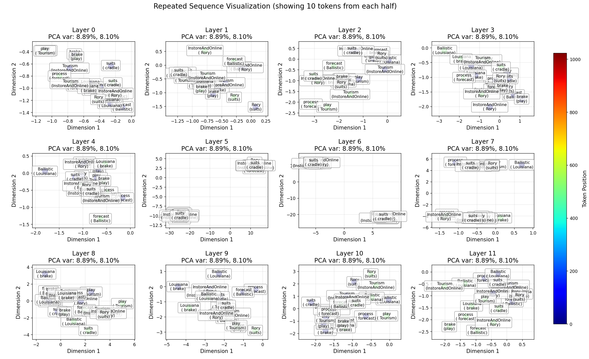
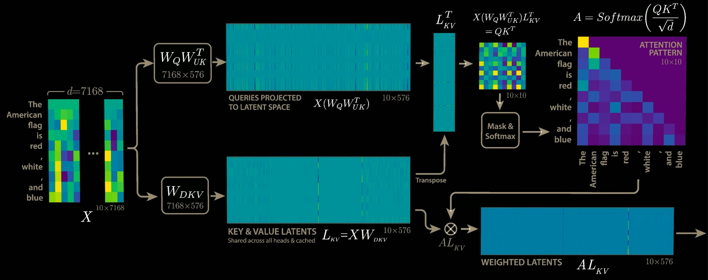
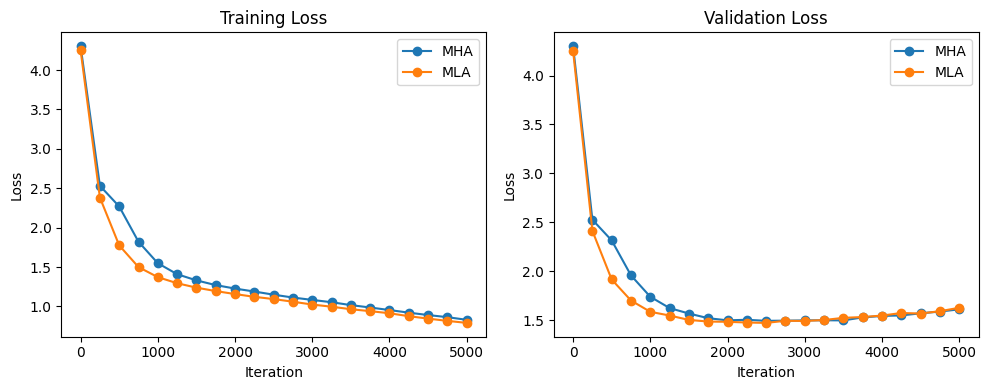

# nanoGPT-MLA

## Last Update: 
#### March 30

- Added support for multi-token prediction (k-ahead prediction)
  - New model architecture in `model_k_ahead.py` that predicts k tokens at once
  - Modified training script `train_k_ahead.py` to support k-ahead prediction
  - Added test script to validate model architecture (model tested, training script pending validation)

- Added `visualize_residual_space_gpt2.py` script to visualize the residual stream activations in GPT-2:



- Projects the 768-dimensional residual stream to 2D using PCA
- Shows the evolution of token representations through all 12 transformer blocks
- Supports both local checkpoints and OpenAI's pretrained weights
- Includes options for repeated sequences and subset plotting

---



This project is a fork of [nanoGPT](https://github.com/karpathy/nanoGPT) that implements and explores Multi-Latent Attention (MLA) as an alternative to standard Multi-Head Attention (MHA) in transformer architectures.

The primary objective of this project is to explore and understand the mechanistic differences between Multi-Head Attention and Multi-Latent Attention in transformer models.

## What to know

- Drop-in replacement for standard attention using Multi-Latent Attention
- Maintains compatibility with the original nanoGPT training pipeline
- Supports both character-level (Shakespeare) and BPE token (GPT-2) training
- Adding testing infrastructure for comparing MHA and MLA models

## Installation

Same dependencies as the original nanoGPT:

```bash
pip install torch numpy transformers datasets tiktoken wandb tqdm
```

## Quick Start: Shakespeare Character-Level Model



To quickly test the implementation and compare MHA vs MLA models:

```bash
# First, prepare the Shakespeare dataset
python data/shakespeare_char/prepare.py

# Run the comparison test (trains both models and generates samples)
python test_shakespeare_quick.py
```

This will train both a standard GPT model and an MLA variant on the Shakespeare dataset, allowing you to compare:
- Training dynamics
- Parameter counts
- Generated text samples
- Final validation loss

You should see a train loss of ~1.22 after 2000 steps.

## Training GPT-2 Scale Models

### 1. Prepare the OpenWebText Dataset

```bash
python data/openwebtext/prepare.py
```

This downloads and tokenizes the OpenWebText dataset using GPT-2's BPE tokenizer.

### 2. Train the Model

For single GPU:
```bash
python train_mla.py config/train_gpt2_mla.py
```

For multiple GPUs on one node:
```bash
torchrun --standalone --nproc_per_node=8 train_mla.py config/train_gpt2_mla.py
```

For multiple nodes:
```bash
# On master node
torchrun --nproc_per_node=8 --nnodes=2 --node_rank=0 --master_addr=123.456.123.456 --master_port=1234 train_mla.py

# On worker node
torchrun --nproc_per_node=8 --nnodes=2 --node_rank=1 --master_addr=123.456.123.456 --master_port=1234 train_mla.py
```

I **have not** tested this yet.

---

Useful context:


The Multi-Latent Attention mechanism modifies the standard transformer attention by:
1. Introducing a shared latent encoder across attention heads (for keys and values ONLY)
2. Reducing the dimensionality of key/query computations
3. Maintaining value projections in the original embedding space

Key differences from standard GPT-2 (code changes):
- Addition of `n_latent` parameter (default: half of `n_embd`)
- Modified attention computation using latent representations
- Shared latent encoder across heads

As for usage:

1. The training script (`train_mla.py`) mirrors the original nanoGPT's `train.py` exactly, just using our MLA model instead.
2. All original nanoGPT features are supported (I THINK?):
   - Distributed training
   - Mixed precision training
   - Gradient accumulation
   - Learning rate scheduling
   - Checkpointing
   - WandB logging


## License

TODO

---

### Changelog

#### Latest Changes

#### March 30, 2024
- Added support for multi-token prediction (k-ahead prediction)
  - New model architecture in `model_k_ahead.py` that predicts k tokens at once
  - Modified training script `train_k_ahead.py` to support k-ahead prediction
  - Added test script to validate model architecture (model tested, training script pending validation)
- Added `visualize_residual_space_gpt2.py` script to visualize the residual stream activations in GPT-2:
- Projects the 768-dimensional residual stream to 2D using PCA
- Shows the evolution of token representations through all 12 transformer blocks
- Supports both local checkpoints and OpenAI's pretrained weights
- Includes options for repeated sequences and subset plotting

#### March 24, 2024
- Added various subspace analysis scripts 
- TODO: Clean repo and put scripts in folders for organization

#### March 20, 2024
- Added sampling infrastructure:
  - Created `sample_mla.py`

## References

1. Catherine Olsson, Nelson Elhage, Neel Nanda, Nicholas Joseph, Nova DasSarma, Tom Henighan, Ben Mann, Amanda Askell, Yuntao Bai, Anna Chen, Tom Conerly, Dawn Drain, Deep Ganguli, Zac Hatfield-Dodds, Danny Hernandez, Scott Johnston, Andy Jones, Jackson Kernion, Liane Lovitt, Kamal Ndousse, Dario Amodei, Tom Brown, Jack Clark, Jared Kaplan, Sam McCandlish, and Chris Olah. In-context learning and induction heads, 2022. URL https://arxiv.org/abs/2209.11895.

2. Kevin Ro Wang, Alexandre Variengien, Arthur Conmy, Buck Shlegeris, and Jacob Steinhardt. Interpretability in the wild: a circuit for indirect object identification in GPT-2 small. In The Eleventh International Conference on Learning Representations, 2023. URL https://openreview.net/forum?id=NpsVSN6o4ul.