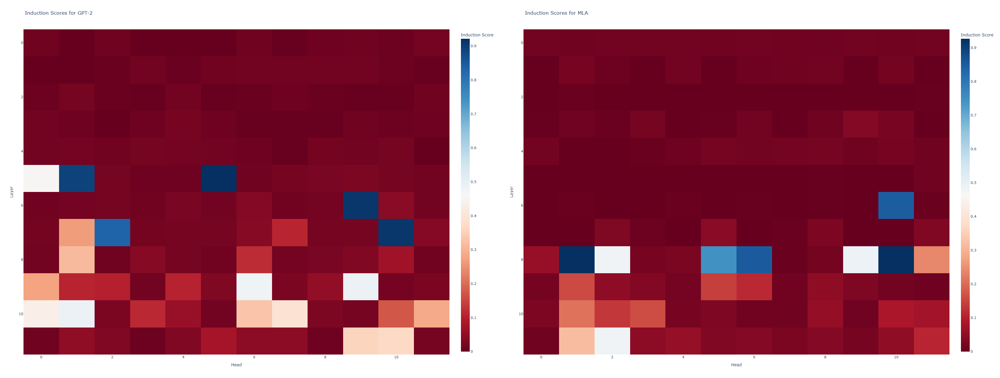

# nanoGPT-MLA

## Last Update: March 21, 2024
- Added induction head detection:
  - Created `find_induction_heads.py` for analyzing attention patterns
  - Implemented hooks to capture attention patterns in both GPT-2 and MLA models
  - Found that MLA does not seem to develop induction heads, suggesting a fundamentally different way of processing sequential information
  - Added visualizations of attention patterns for both architectures



The heatmaps above show the induction scores for each attention head in both architectures. While GPT-2 shows clear induction heads (bright spots indicating heads that strongly attend to repeated tokens), MLA shows much more diffuse attention patterns, suggesting it processes sequential dependencies differently.

---


---


This project is a fork of [nanoGPT](https://github.com/karpathy/nanoGPT) that implements and explores Multi-Latent Attention (MLA) as an alternative to standard Multi-Head Attention (MHA) in transformer architectures.

The primary objective of this project is to explore and understand the mechanistic differences between Multi-Head Attention and Multi-Latent Attention in transformer models.

## What to know

- Drop-in replacement for standard attention using Multi-Latent Attention
- Maintains compatibility with the original nanoGPT training pipeline
- Supports both character-level (Shakespeare) and BPE token (GPT-2) training
- Adding testing infrastructure for comparing MHA and MLA models

## Installation

Same dependencies as the original nanoGPT:

```bash
pip install torch numpy transformers datasets tiktoken wandb tqdm
```

## Quick Start: Shakespeare Character-Level Model


To quickly test the implementation and compare MHA vs MLA models:

```bash
# First, prepare the Shakespeare dataset
python data/shakespeare_char/prepare.py

# Run the comparison test (trains both models and generates samples)
python test_shakespeare_quick.py
```

This will train both a standard GPT model and an MLA variant on the Shakespeare dataset, allowing you to compare:
- Training dynamics
- Parameter counts
- Generated text samples
- Final validation loss

You should see a train loss of ~1.22 after 2000 steps.

## Training GPT-2 Scale Models

### 1. Prepare the OpenWebText Dataset

```bash
python data/openwebtext/prepare.py
```

This downloads and tokenizes the OpenWebText dataset using GPT-2's BPE tokenizer.

### 2. Train the Model

For single GPU:
```bash
python train_mla.py config/train_gpt2_mla.py
```

For multiple GPUs on one node:
```bash
torchrun --standalone --nproc_per_node=8 train_mla.py config/train_gpt2_mla.py
```

For multiple nodes:
```bash
# On master node
torchrun --nproc_per_node=8 --nnodes=2 --node_rank=0 --master_addr=123.456.123.456 --master_port=1234 train_mla.py

# On worker node
torchrun --nproc_per_node=8 --nnodes=2 --node_rank=1 --master_addr=123.456.123.456 --master_port=1234 train_mla.py
```

I **have not** tested this yet.

---

Useful context:


The Multi-Latent Attention mechanism modifies the standard transformer attention by:
1. Introducing a shared latent encoder across attention heads (for keys and values ONLY)
2. Reducing the dimensionality of key/query computations
3. Maintaining value projections in the original embedding space

Key differences from standard GPT-2 (code changes):
- Addition of `n_latent` parameter (default: half of `n_embd`)
- Modified attention computation using latent representations
- Shared latent encoder across heads

As for usage:

1. The training script (`train_mla.py`) mirrors the original nanoGPT's `train.py` exactly, just using our MLA model instead.
2. All original nanoGPT features are supported (I THINK?):
   - Distributed training
   - Mixed precision training
   - Gradient accumulation
   - Learning rate scheduling
   - Checkpointing
   - WandB logging


## License

TODO

---

### Changelog

#### March 20, 2024
- Added sampling infrastructure:
  - Created `sample_mla.py` for generating text from MLA model
  - Added `slurm_scripts/run_mla_sample.sh` for running sampling from both GPT-2 and MLA models
  - Added support for comparing outputs between standard GPT-2 and MLA models
- Trained both models to convergent loss (matching the reported loss for the same configuration)

#### March 19, 2024
- Fixed DDP (Distributed Data Parallel) training:
  - Properly handled gradient accumulation with DDP using `model.no_sync()`
  - Fixed MFU (Model Flops Utilization) calculation for DDP by accessing `model.module`
  - Added proper wandb initialization for multi-GPU training
- Memory optimizations:
  - Reduced micro-batch size from 12 to 6 (then it can run on `a100-4` partition of MSI)
  - Adjusted gradient accumulation steps to maintain same effective batch size
  - Disabled model compilation to prevent OOM issues (taking too long on 4 A100s, maybe more sys RAM could have helped?)
- Infrastructure improvements:
  - Added automatic output directory creation
  - Updated wandb project configuration. Just make sure to have a wandb project named `gpt2mla` if you want to leave it on
  - Fixed gradient scaling deprecation warnings
- Improved Weights & Biases logging:
  - Added proper wandb initialization with resume support
  - Added detailed training metrics logging every `log_interval` iterations:
    - Training loss
    - Time per iteration (ms)
    - Model Flops Utilization (MFU)
    - Current learning rate
  - Added validation metrics logging every `eval_interval` iterations:
    - Training loss
    - Validation loss
    - Learning rate
    - MFU percentage
